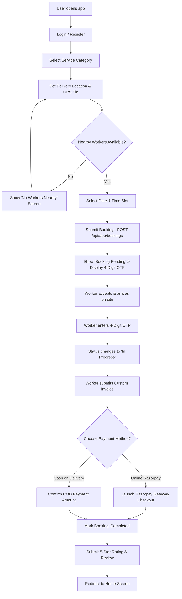
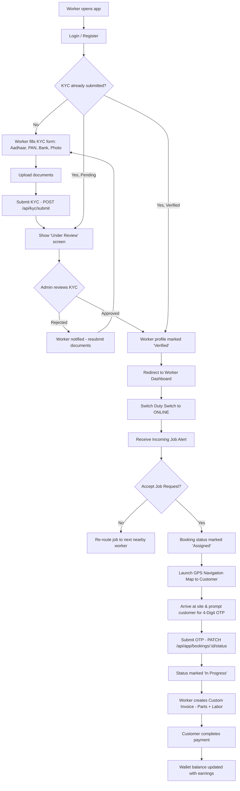
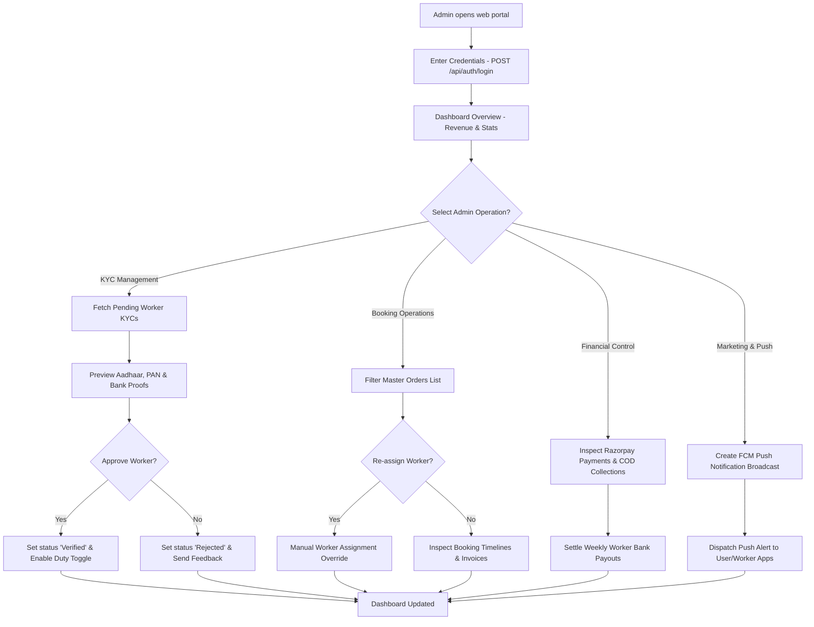

# 📊 Service App System - Clean System Flowcharts (User, Worker & Admin)

This document provides **Clean System Flowcharts** matching your exact decision-tree flowchart style for:
1. 📱 **User Mobile App Flowchart**
2. 👷 **Worker Mobile App Flowchart**
3. 🖥️ **Admin Web Panel Flowchart**

---

## 📱 1. User Mobile App - Complete Execution Flowchart

### 🔹 User App Vector Flowchart Code (Mermaid):

---

## 👷 2. Worker Mobile App - Complete Execution Flowchart

### 🔹 Worker App Vector Flowchart Code (Mermaid):

---

## 🖥️ 3. Admin Web Panel - Operations & Management Flowchart

### 🔹 Admin Panel Vector Flowchart Code (Mermaid):

