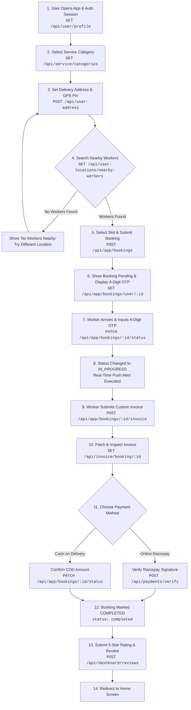
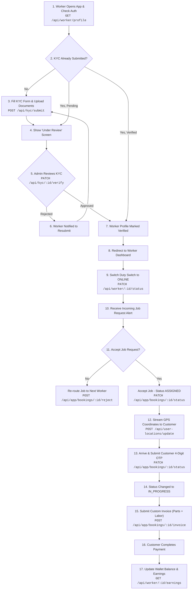
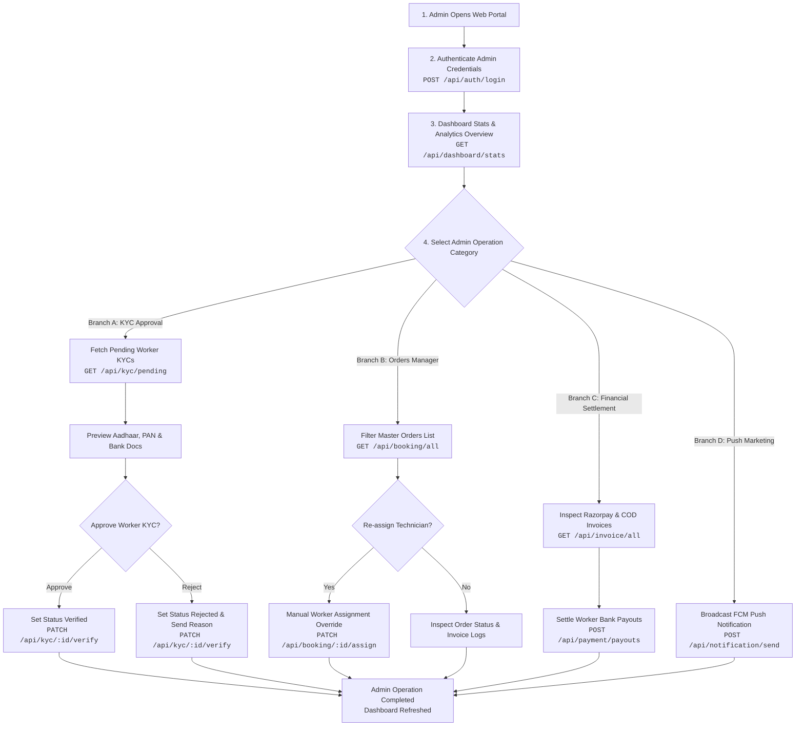
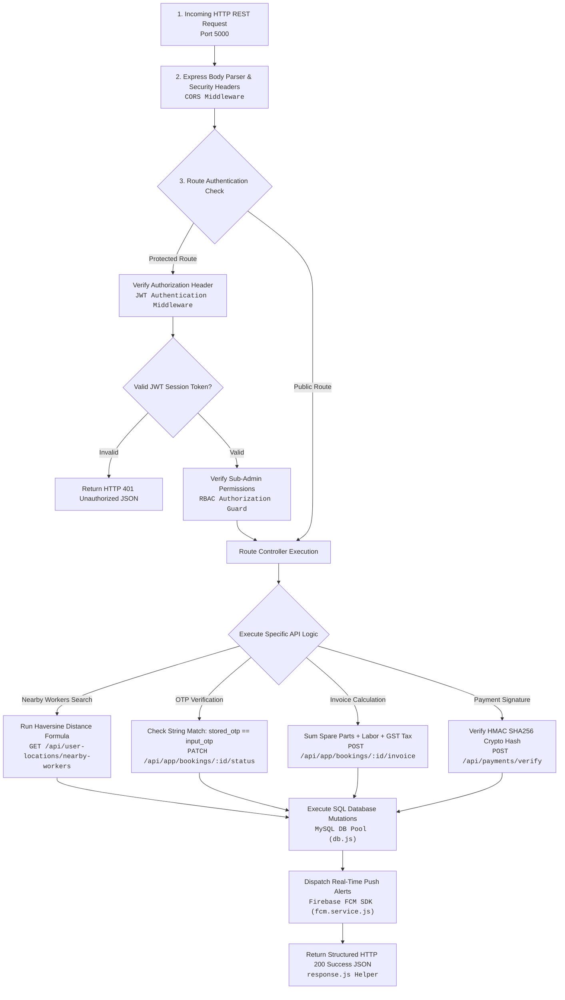

# 📊 Service App System - Exact API Vector Flowcharts (Mermaid & Visual Images)

This document provides **Vector Mermaid Flowchart Code** and **Visual Flowchart Diagrams** where **every single box explicitly displays the exact API Endpoint and HTTP Method** directly inside the node.

---

## 📱 1. User Mobile App - Exact API Vector Flowchart

---

## 👷 2. Worker Mobile App - Exact API Vector Flowchart

---

## 🖥️ 3. Admin Web Panel - Exact API Vector Flowchart

---

## ⚙️ 4. Backend Processing Pipeline - Exact API Vector Flowchart

