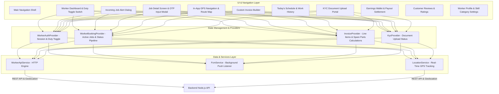
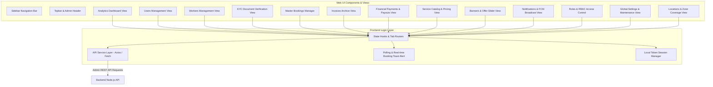
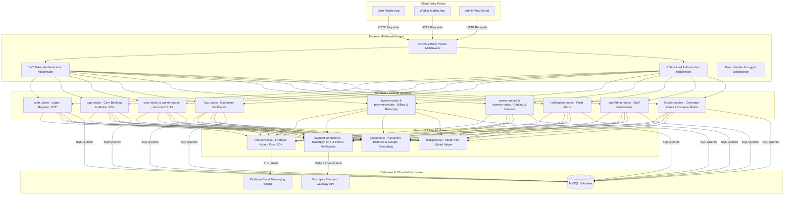

# 🏛️ Service App System - 4 Main Components Architecture Diagrams

This document provides dedicated software architecture diagrams and detailed component breakdowns for the 4 core applications of the platform:
1. 📱 **User Mobile App Architecture** (Flutter)
2. 👷 **Worker Mobile App Architecture** (Flutter)
3. 🖥️ **Admin Web Panel Architecture** (React / Vite)
4. ⚙️ **Backend REST API & Infrastructure Architecture** (Node.js / Express / MySQL / FCM / Razorpay)

---

## 📱 1. User Mobile App Architecture (Flutter)

The User Mobile App is structured using Flutter Provider for state management, HTTP service layer for API communication, and modular screens.

```mermaid
graph TD
    subgraph UI & Navigation Layer
        A1[Main Shell & Bottom Navbar]
        A2[Home Screen & Service Search]
        A3[Location Picker & Address Manager]
        A4[Service Detail View]
        A5[Nearby Worker Discovery]
        A6[Booking Form & Time Slot Selector]
        A7[My Bookings & OTP Display Badge]
        A8[Live GPS Worker Tracker]
        A9[Custom Invoice Viewer]
        A10[Razorpay Payment Checkout]
        A11[Rating & Review Modal]
        A12[Helpdesk & Support Center]
    end

    subgraph State Management & Controllers (Provider)
        B1[AuthProvider - JWT & User Session]
        B2[BookingProvider - Active & Past Orders]
        B3[LocationProvider - Map Coordinates & Saved Addresses]
        B4[NotificationProvider - FCM Push Tokens]
    end

    subgraph Data & Network Layer
        C1[ApiService - HTTP Request Client]
        C2[ApiConfig - Base URL & Headers]
        C3[LocalStorage - Secure Token Storage]
    end

    A2 & A3 & A5 & A6 & A7 --> B1 & B2 & B3 & B4
    B1 & B2 & B3 & B4 --> C1
    C1 --> C2 & C3
    C1 -->|REST API Requests| API[Backend Node.js API]
```

### 🔹 Key Responsibilities & Data Flow:
* **Service Discovery:** Queries backend for categories, services, pricing, and active banners.
* **Geocoding & Location:** Integrates Google Maps API for coordinate pin-drop and saved address selection.
* **Order Lifecycle & OTP:** Displays real-time booking status updates and presents a **4-digit Job Start OTP** to give to the technician.
* **Payment Integration:** Launches Razorpay Checkout SDK for online transactions or confirms Cash on Delivery (COD).

---

## 👷 2. Worker Mobile App Architecture (Flutter)

The Worker Mobile App enables field technicians to manage duty availability, accept jobs, verify start OTPs, generate custom invoices, and navigate to customer locations.



### 🔹 Key Responsibilities & Data Flow:
* **Duty Status Management:** Toggles worker availability (`online` / `offline`) to start or stop receiving job dispatches.
* **Job Execution & OTP:** Receives push job alerts, accepts assignments, and inputs the customer's 4-digit OTP to start the job.
* **Custom Billing:** Allows technicians to add extra labor fees and spare part line items to calculate and submit final invoices.
* **Field Navigation:** Streams GPS coordinates for live customer tracking and turn-by-turn route directions.

---

## 🖥️ 3. Admin Web Panel Architecture (React / Vite)

The Admin Web Panel is a single-page web app (SPA) built with React and CSS design tokens, providing complete platform administration.



### 🔹 Key Responsibilities & Data Flow:
* **Platform Operations:** Full oversight of users, workers, KYC approvals, service categories, and promotional banners.
* **Live Monitoring:** Real-time polling and toast alerts for incoming bookings and system activity.
* **Financial & Settlement Oversight:** Tracking Razorpay payment transactions, COD collections, platform commissions, and worker payouts.
* **Security & Access:** Role-Based Access Control (RBAC) to configure sub-admin staff permissions.

---

## ⚙️ 4. Backend REST API & Infrastructure Architecture

The Backend API is built on Node.js and Express with modular routing, MySQL relational database storage, Firebase Cloud Messaging (FCM) integration, and Razorpay payment handling.



### 🔹 Key Responsibilities & Data Flow:
* **Multi-Role Authentication:** Phone OTP validation, bcrypt password hashing, and JWT token issue.
* **Distance Matrix Engine:** Computes distance in kilometers using Haversine equations to find nearby active workers.
* **Billing & Tax Calculator:** Formulates custom invoice totals with line items, labor fees, platform commissions, and GST taxes.
* **FCM Push Notification Dispatch:** Triggers real-time push alerts to mobile devices upon state transitions.
