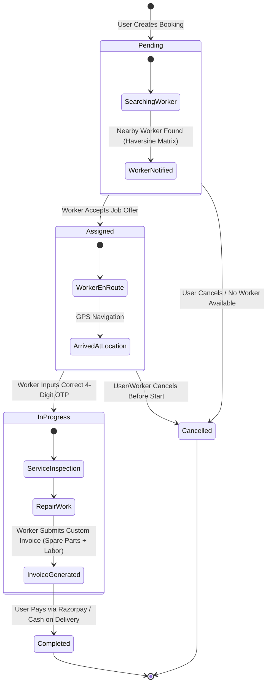
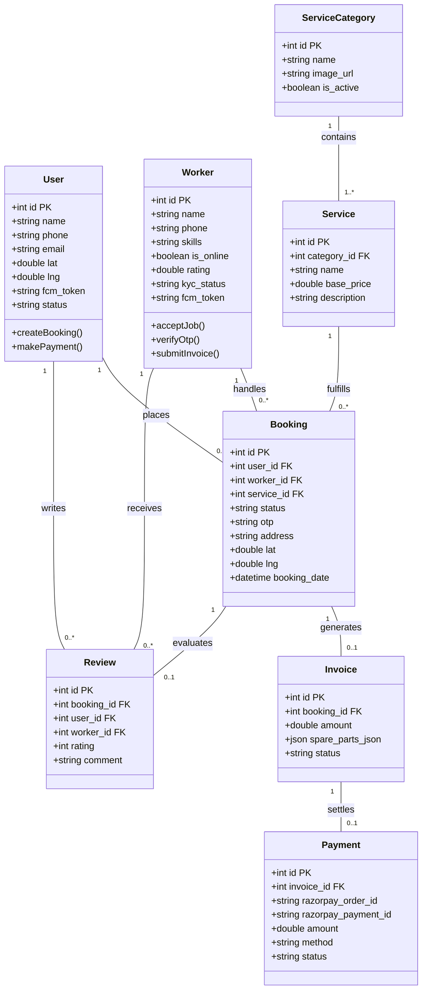
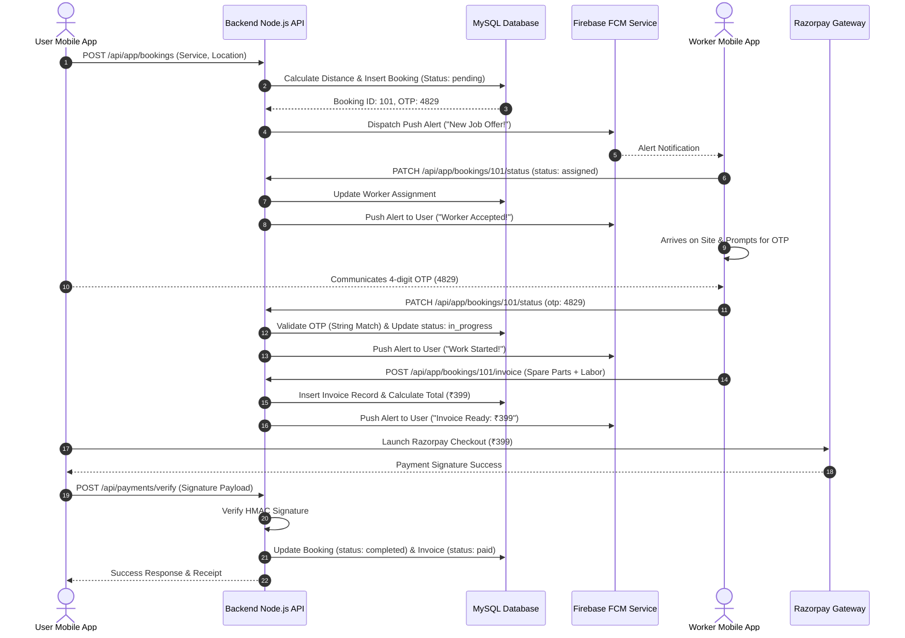

# 📐 Service App System - Professional Software Engineering Diagrams

This document contains standard, professional UML software engineering diagrams for the Service App system:
1. **Booking Lifecycle State Machine Diagram** (UML State Diagram)
2. **Database Class & Entity-Relationship Diagram** (UML Class/ERD Diagram)
3. **End-to-End Inter-Component Sequence Diagram** (UML Sequence Diagram)
4. **Full-Stack System Component Architecture Diagram** (UML Component Architecture)

---

## 🔄 1. Booking Lifecycle State Machine Diagram (UML State Diagram)

This state machine models the lifecycle transitions of a booking from creation to completion or cancellation.




---

## 🗄️ 2. Database Class & Entity-Relationship Diagram (UML Class/ERD)

This class diagram defines the data models, attributes, primary/foreign keys, and 1:N / N:M relationships across MySQL tables.



---

## ⏱️ 3. End-to-End Inter-Component Sequence Diagram (UML Sequence)

This sequence diagram depicts the chronological interaction between the User App, Worker App, Backend API, Database, Razorpay Gateway, and Firebase FCM.



---

## 🏗️ 4. Full-Stack System Component Architecture Diagram

This component diagram displays the system boundaries, frontend client apps, API layer, database, and 3rd party external services.

```mermaid
graph TD
    subgraph Client Layer (Frontend & Mobile)
        A1[User Flutter Mobile App]
        A2[Worker Flutter Mobile App]
        A3[Admin Web Portal - React/Vite]
    end

    subgraph API & Backend Gateway Layer
        B1[Node.js / Express REST API]
        B2[JWT Authentication & RBAC Middleware]
        B3[Haversine Distance Matrix Engine]
        B4[Billing & GST Calculation Engine]
    end

    subgraph Persistence Layer
        C1[(MySQL Relational Database)]
    end

    subgraph External Cloud Services
        D1[Razorpay Payment Gateway]
        D2[Firebase Cloud Messaging - FCM]
        D3[Google Maps Geocoding API]
    end

    A1 -->|REST HTTP / JSON| B1
    A2 -->|REST HTTP / JSON| B1
    A3 -->|REST HTTP / JSON| B1

    B1 --> B2
    B1 --> B3
    B1 --> B4

    B1 -->|SQL Queries| C1
    
    B1 -->|SDK Payments| D1
    B1 -->|Push Dispatch| D2
    B1 -->|Geocoding| D3
```
